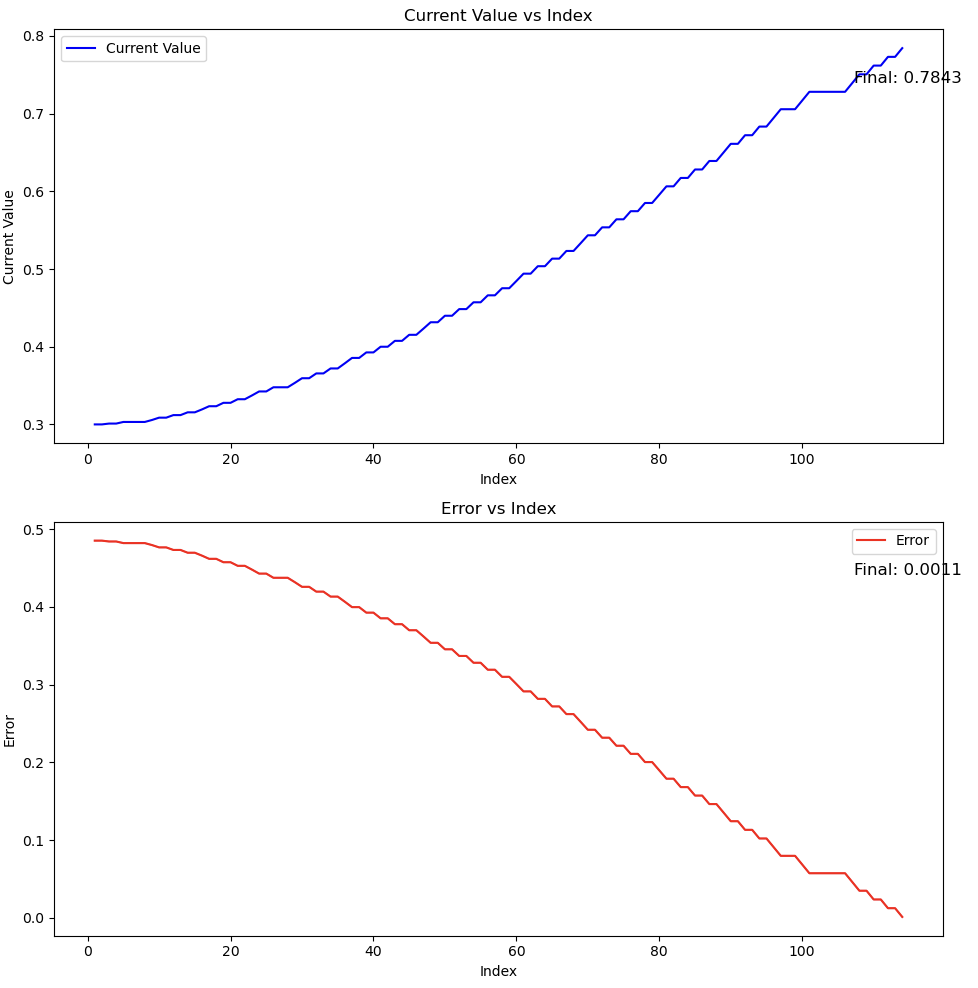
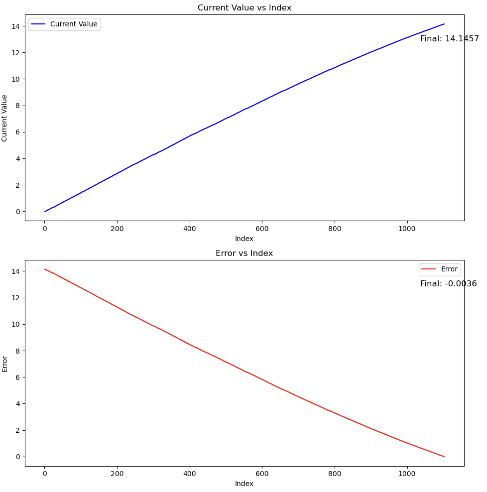
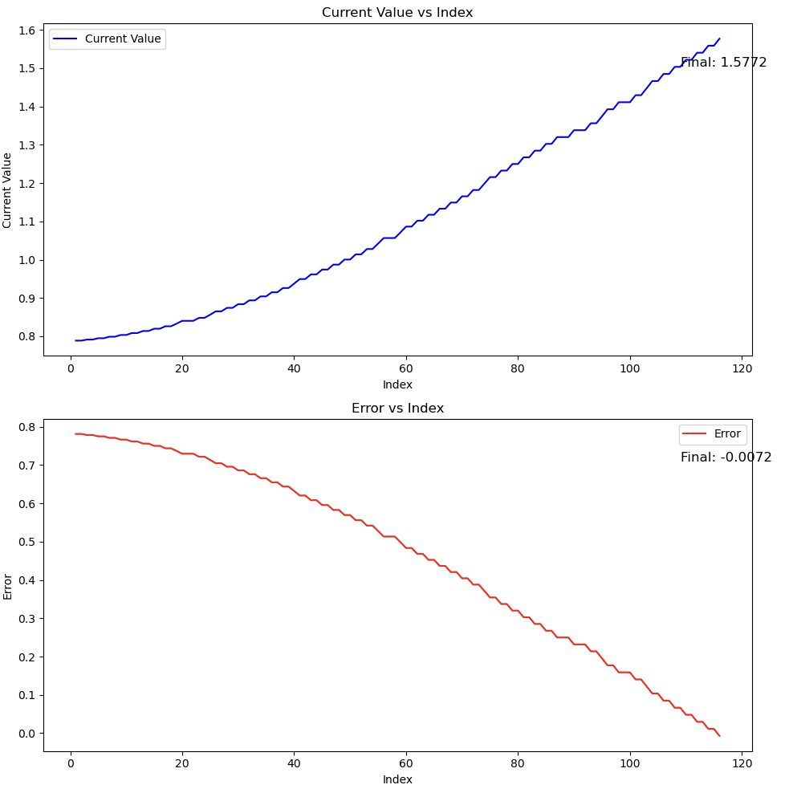

## Limo Controller Description

The `limo_controller` package implements a state-based controller. Its functions are:
- Subscribing to the `/odom` topic to get the robot's current pose.
- Computing linear and angular errors.
- Using a state machine to transition through control phases:
  - **State 0:** Adjusts the angular orientation toward the goal.
  - **State 1:** Drives the robot linearly toward the target.
  - **State 2:** Adjusts for the final orientation upon arrival.
- Publishing command velocities over `/cmd_vel` every 20ms to drive the robot using a PI controller.

### Control Flow

1. **Initialization:**  
   A target pose is configured in the limo controller node constructor.

2. **Odometry Callback:**  
   Odometry messages update the robot's current state, which is then used in the control loop.

3. **Continuous Control Loop:**  
   A timer of 20ms repeatedly triggers the control function. Based on the current state, the appropriate control routine (angular or linear) is executed.

4. **State Transitions & Integrals Reset:**  
   Upon satisfying the control objectives the controller advances to the next state and resets the integral accumulators to prevent windup.

## Results

With the parameters of (10, 10, 1.57) for x, y, and theta respectively, we see in the below video that the final real-world pose is (10.00, 9.99, 1.62). This gives us a euclidean error of ~0.7cm  and an angular offset error of 0.05 radians. These values may deviate from run to run based on the conditions affecting real-world pose.

## Demo Video

https://github.com/user-attachments/assets/de59bfe3-4223-4264-886c-e4e2adbc1893

## Results of estimated error based on /odom for (10, 10, 1.57)
This prepresents the control errors and values, stating the measured values from the /odom topic over time compared to the target pose. The graphs below illustrate the angular and euclidean errors recorded at 20ms intervals (each represented by an increment of 1 index).

### Angular value and error (state 0) over 20ms increments


### Euclidean distance and error (state 1) over 20ms increments


### Angular value and error (state 2) over 20ms increments

  
# Task Description

Please read through [this](https://www.overleaf.com/read/dmgrrcmpkbkq#211e69) document before moving forward.

### Software Structure
```
- docker -- Where the Dockerfile lives.
- scripts -- Where necessary external scripts live.
- workspace -- Where all the packages live.
```

### Build the simulator

```bash
./scripts/build/sim.sh
```

### Run the simulator

```bash
./scripts/deploy/devel.sh # To enter the docker container
ros2 launch limo_simulation limo.launch.py # To launch the simulator
```

### What do I edit?

1. Modify the package `limo_control` in the workspace directory for adding your c++ controller program.
2. Make a launch file that can launch everything (Controller and Simualation).
3. Modify `scripts/deploy/app.sh` such that, when `scripts/deploy/start.sh` is run, the task is executed automatically.

### Known Issues

1. This will not work with docker desktop, please do not use it, use the default engine.

Feel free to modify anything else if it does not work as expected.
